# GT_Gaming Hub

A personal streaming hub and RPG game showcase for GT_Gaming — a multi-platform streamer specialising in story-driven RPGs and chill gaming sessions.

The site serves as a central destination for fans to explore the game library, browse past stream sessions, vote on games, and find GT_Gaming across all platforms.

---

## About the Project

GT_Gaming Hub is a passion project built to:

- Showcase an active RPG game library split across two stream categories: **Let's Play** (full story playthroughs, 6+ hours) and **Chill Streams** (~2 hours, casual gameplay)
- Link visitors to GT_Gaming's channels on **YouTube**, **Twitch**, **Kick**, and **Rumble**
- Allow fans to browse game detail pages with stream session history, VOD links, and community voting
- Serve as a personal brand hub with a consistent black and red visual identity

---

## Tech Stack

| Technology | Version | Purpose |
|---|---|---|
| [Angular](https://angular.dev) | 21.2.0 | Frontend framework (standalone components, signals, lazy loading) |
| [Tailwind CSS](https://tailwindcss.com) | 3.3.3 | Utility-first styling with custom design tokens |
| [TypeScript](https://www.typescriptlang.org) | 5.9.2 | Type-safe development |
| [Angular Router](https://angular.dev/guide/routing) | 21.2.0 | Client-side routing with lazy-loaded routes |
| [@angular/animations](https://angular.dev/guide/animations) | 21.2.0 | Required by Angular platform (`provideAnimationsAsync`) |
| [Playwright](https://playwright.dev) | 1.x | End-to-end testing across Chromium, Firefox, and WebKit |

---

## Features

- **Game Library** — Responsive card grid with cover art, genre, hours played, and stream type badges
- **Filter & Search** — Filter games by stream type (All / Let's Play / Chill) and search by title in real time
- **Game Detail Pages** — Per-game view with voting, stream session list, platform badges, and subscribe modal
- **About Page** — Streamer profile with avatar, bio, platform links, and stream type breakdown
- **Dark / Light Theme Toggle** — Dark mode by default, switchable via navbar
- **Custom Branding** — Tarrget Academy Italic font, black and red colour palette
- **Lazy Loading** — Feature routes loaded on demand for faster initial page load
- **404 Page** — Styled not-found page for unknown routes
- **CSS Page Transitions** — Smooth fade and slide-up animation on every route change
- **Responsive Design** — Mobile-first layout across all pages, hamburger menu on mobile
- **Per-Route Page Titles** — Unique browser tab title on every route, dynamic on game detail

---

## Project Structure

```
src/
├── app/
│   ├── core/
│   │   ├── animations/       # Route transition animation definitions (reference)
│   │   ├── layout/           # App shell (navbar + router outlet)
│   │   ├── navbar/           # Responsive navigation with hamburger menu
│   │   └── services/
│   │       └── game.service.ts   # Single source of truth for all game data
│   └── features/
│       ├── about/            # Streamer profile page
│       ├── game-detail/      # Per-game detail, sessions, voting
│       ├── home/             # Game library with filter and search
│       └── not-found/        # 404 page
├── styles.css                # Global styles, @font-face, page animations
└── index.html                # App entry point (dark mode class default)

public/
├── fonts/                    # Tarrget font family (.ttf files)
└── images/
    ├── avatars/              # Streamer avatar
    ├── covers/               # Game cover art
    └── screenshots/          # Breakpoint screenshots (mobile / tablet / desktop)

e2e/
└── example.spec.ts           # Playwright end-to-end tests

scripts/
└── screenshots.mjs           # Auto-generates breakpoint screenshots via Playwright
```

---

## Getting Started

### Prerequisites

- [Node.js](https://nodejs.org) v18 or later
- [Angular CLI](https://angular.dev/tools/cli) v21

### Install dependencies

```bash
npm install
```

### Run development server

```bash
ng serve
```

Navigate to `http://localhost:4200/`. The app reloads automatically on file changes.

### Build for production

```bash
ng build
```

Build artifacts are output to the `dist/` directory.

### Run e2e tests

```bash
npx playwright test
```

Playwright starts `ng serve` automatically if it isn't already running. To view the HTML report after a run:

```bash
npx playwright show-report
```

---

## Screenshots

Screenshots captured at three breakpoints — **mobile** (390px · iPhone 14),
**tablet** (768px · iPad), and **desktop** (1280px).

> To regenerate screenshots run `ng serve` then `node scripts/screenshots.mjs`.

---

### Home — Game Library

| Mobile | Tablet | Desktop |
|--------|--------|---------|
| 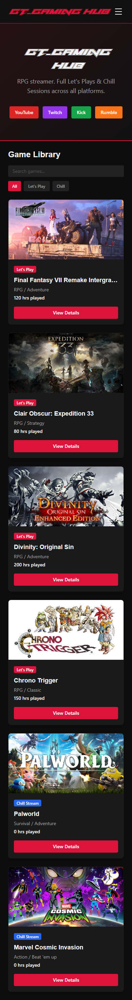 | 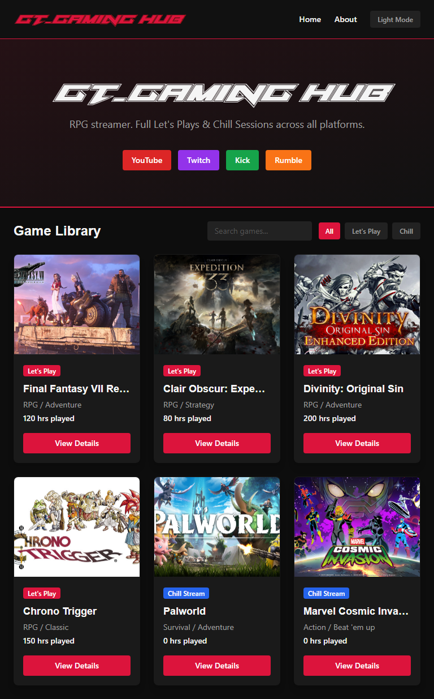 | 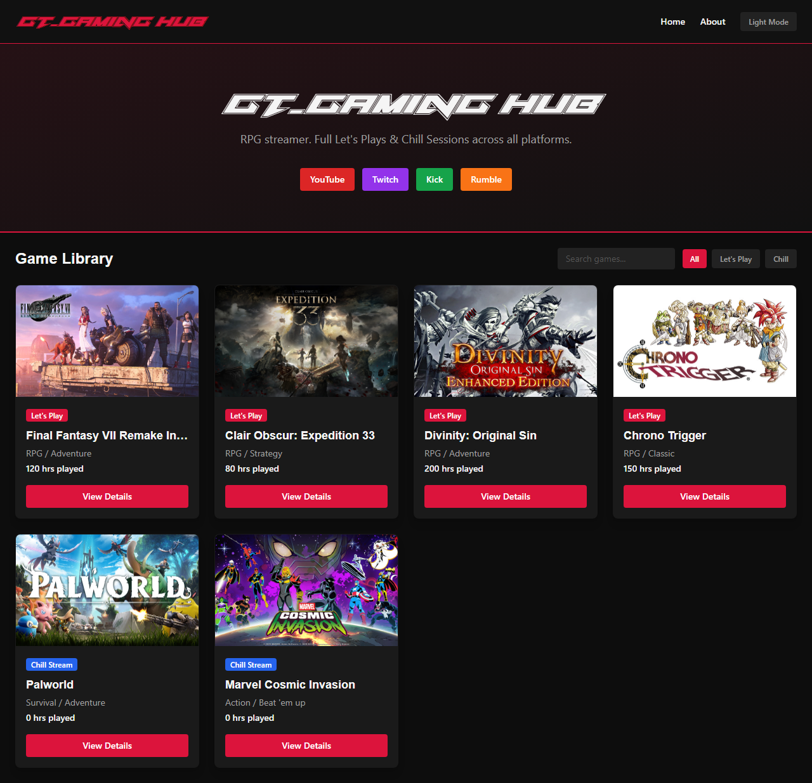 |

---

### Game Detail

| Mobile | Tablet | Desktop |
|--------|--------|---------|
| 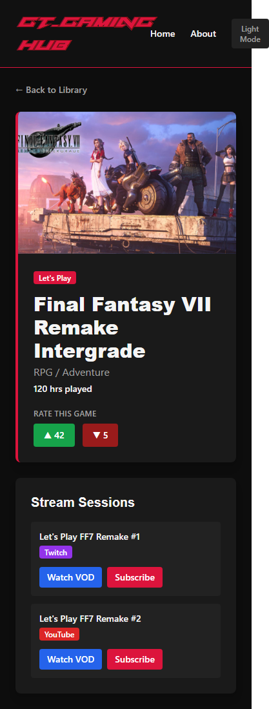 | 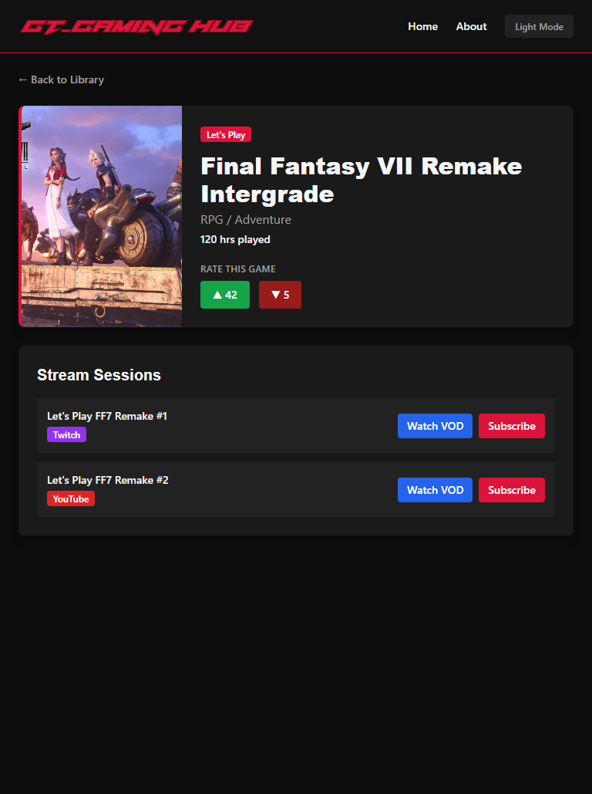 | 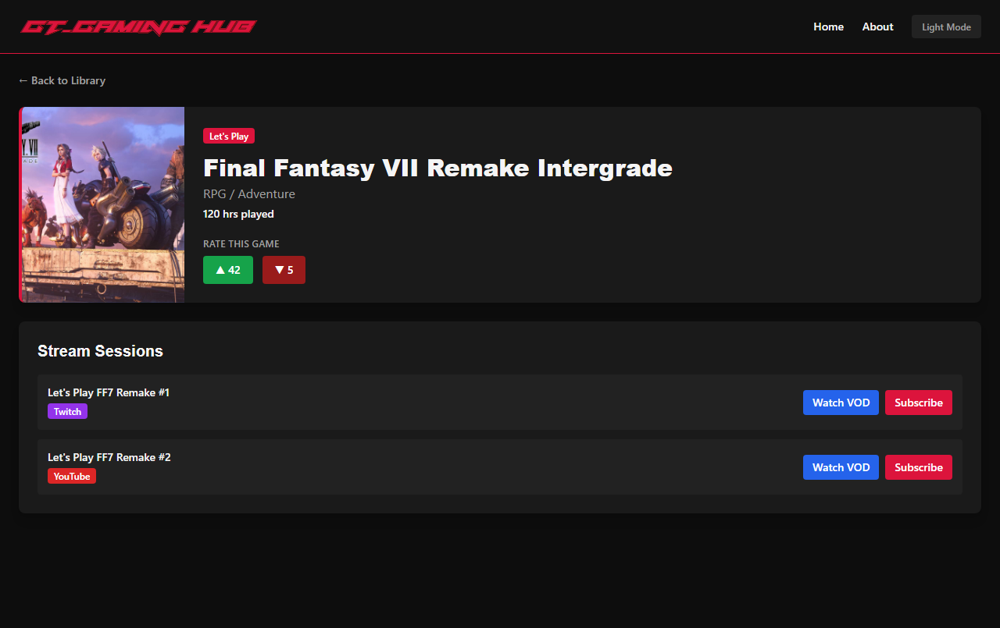 |

---

### About Page

| Mobile | Tablet | Desktop |
|--------|--------|---------|
| 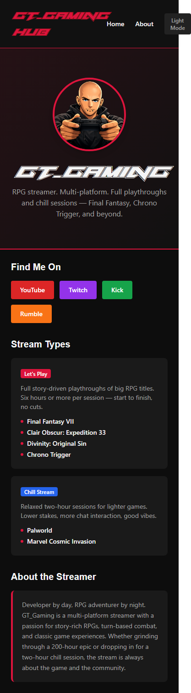 | 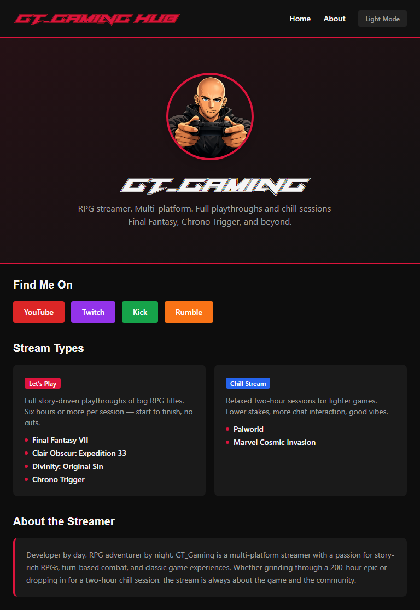 | 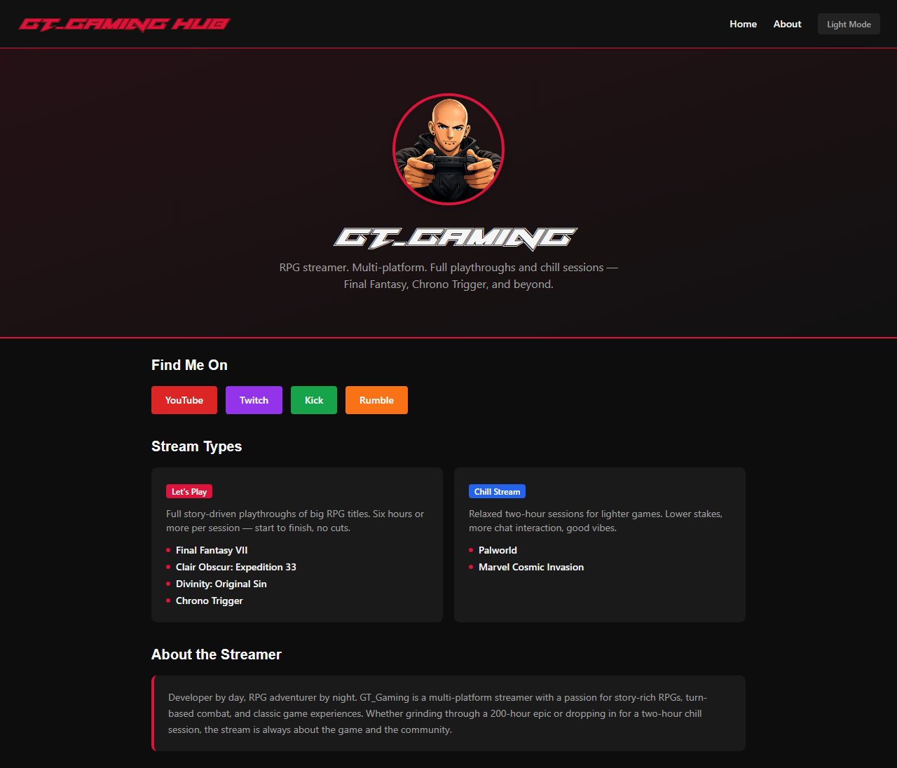 |

---

### 404 Page

| Mobile | Tablet | Desktop |
|--------|--------|---------|
| 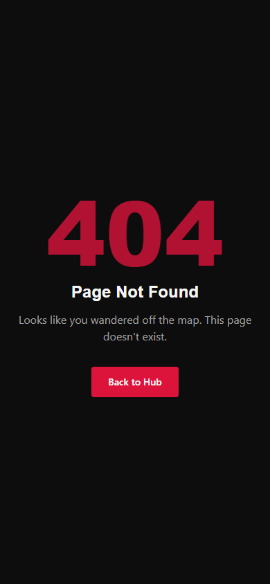 | 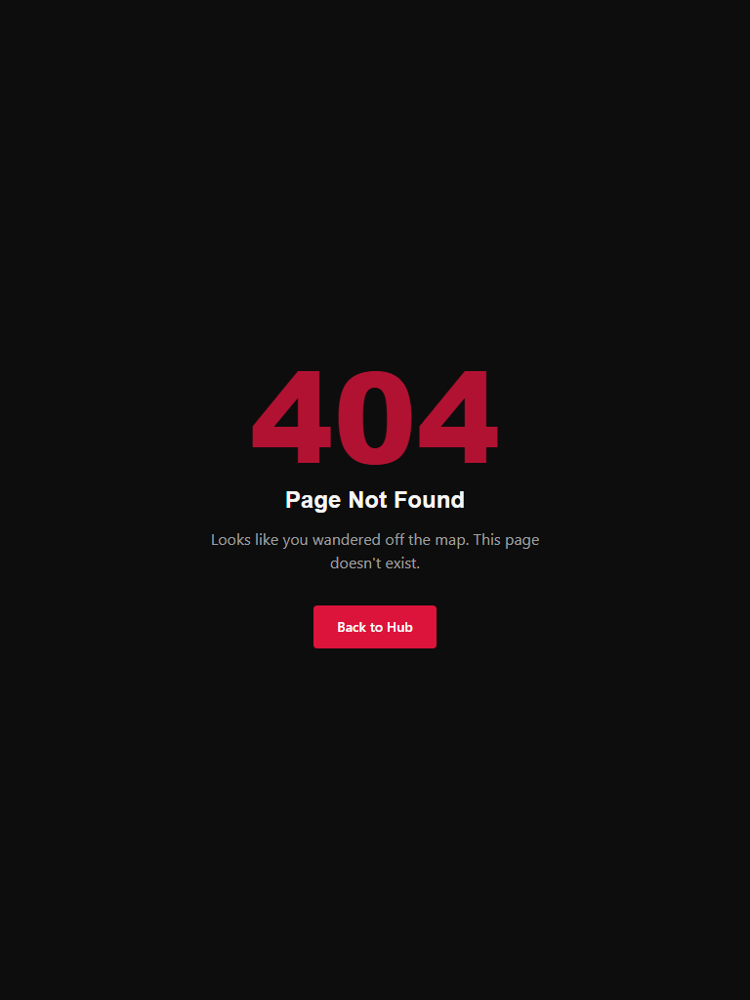 | 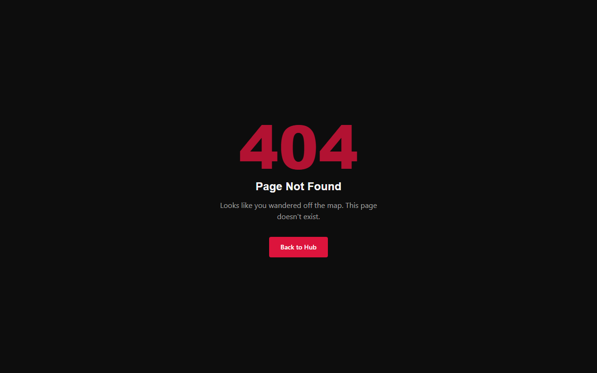 |
